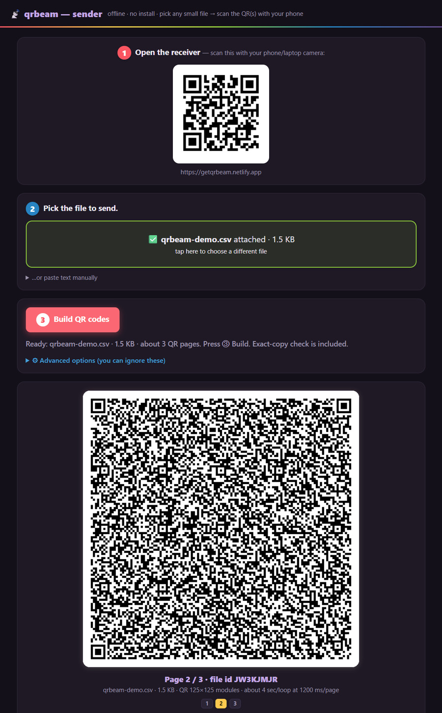
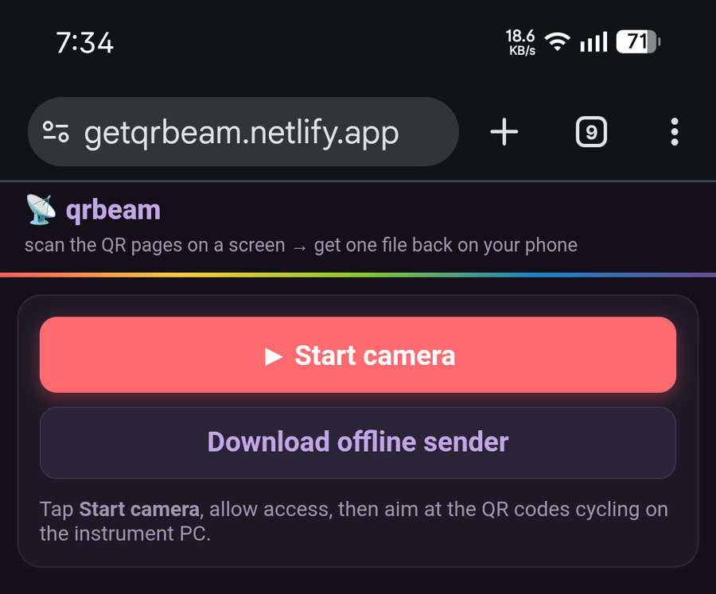
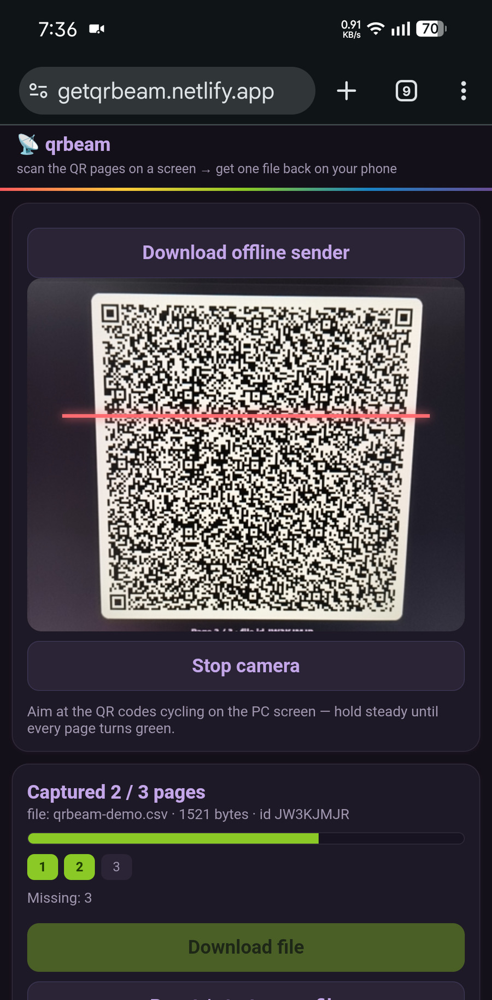
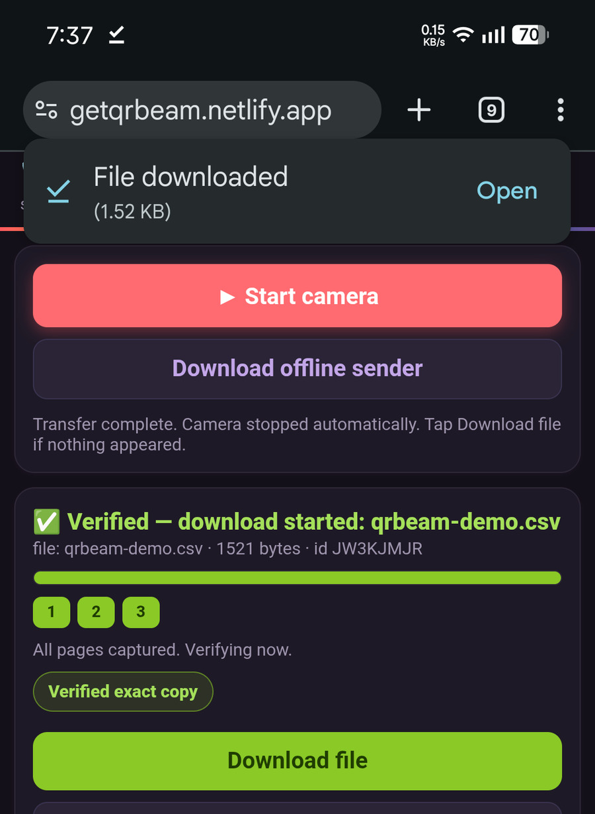

# 📡 qrbeam

**Beam a small file from one screen to another device by QR code. No cable, no USB, no app, no network between the two machines.**

🔗 **Live receiver:** https://getqrbeam.netlify.app

qrbeam moves a file off an offline or locked-down computer (no USB slot free, no shared network, no way to install anything) by turning it into a stream of QR codes on screen. Any phone or laptop camera reads the stream and reassembles it back into the original file.

The first use was pulling data exports off an air-gapped Windows 7 lab instrument after a forgotten USB stick. It works for any small file on any machine.

---

## In action

### 1. Build on the offline computer

<p align="center">
  <br>
  <sub>A small CSV becomes a three-page QR loop on the source computer.</sub>
</p>

### 2. Open the receiver on a phone

<p align="center">
  <br>
  <sub>The hosted page starts the camera and offers the offline sender as a direct download.</sub>
</p>

### 3. Capture the QR pages

<p align="center">
  <br>
  <sub>The receiver fills the page grid and names the page still missing.</sub>
</p>

### 4. Verify and download

<p align="center">
  <br>
  <sub>The receiver checks the rebuilt file, then the phone downloads it.</sub>
</p>

---

## How it works

qrbeam has two halves that never share a network. The only link is a camera looking at a screen.

| | | |
|---|---|---|
| **Sender** | `sender/QR-Transfer.html` | A single offline HTML file. Runs on the source machine straight from disk by double-click, with no install and no internet. Reads any file, Base64-encodes it, splits it into chunks, and shows the chunks as QR codes (one at a time, or an auto-cycling loop). |
| **Receiver** | `receiver/index.html` | A hosted web app (HTTPS, for camera access). Open it on a phone or laptop, point the camera at the sender screen, and it catches every page, skips duplicates, reassembles the file, and auto-downloads it with the correct name and type. |

Each QR carries a small header, `QRT4|fileId|page|total|filename|bytes|sha256|dataLength|data`, so the receiver can order the chunks, skip duplicates already seen, know when the full set has arrived, and reset cleanly when a new file starts. The byte count and SHA-256 hash let the receiver confirm it rebuilt the exact file before saving. Later pages are padded after the real data so every QR in a batch stays the same visual size.

```
[ offline PC ]                         [ phone / laptop ]
  sender.html  ──shows QR pages──►  camera  ──►  receiver (getqrbeam.netlify.app)
                                                      │
                                                      ▼
                                               downloads original file
```

---

## How this came to be

*(the origin story, for the curious)*

The lab has a Hitachi F-4600 fluorescence spectrophotometer on a Windows 7 PC that stays off the network, has no free USB port, and that IT would rather nobody touch. Data left that machine on a USB stick, carried by hand.

One evening a run finished and the stick was gone from the pocket. It sat at a desk across the building. The data was a 7 KB text file, right there on the screen, and reaching it meant a walk both ways for a cable.

The idea came from an earlier build, a small membership website ([kalyanparisad.in](https://kalyanparisad.in)) that draws a UPI payment QR in the browser from a line of text. A QR is text rendered as a picture, made on the spot, no image file anywhere. That scales. Many QR codes in sequence can carry a whole file. The screen was already there. A phone camera was already there.

qrbeam is that taken seriously. The offline machine paints the file across a handful of QR codes, a camera reads them back, and the file reassembles on the far side. No USB. No network between the two. Nothing installed on the locked-down PC.

> For the other escape hatch on the same instrument, reading the proprietary binary files straight off disk, see [**spectrex**](https://github.com/tardigrade1001/spectrex).

## Usage

Share the tool by sending people to **https://getqrbeam.netlify.app**. The page has the receiver and a **Download offline sender** button, so users do not need to visit GitHub.

**On the source machine (offline):**
1. Save the offline sender HTML from the live receiver page, then open it on the source machine by double-click. Once saved, it works with no internet.
2. **① Open the receiver.** Scan the QR at the top with a phone or laptop to open `getqrbeam.netlify.app` there.
3. **② Pick the file** by drag and drop or browse. Up to about 50 KB, best under about 20 KB.
4. **③ Build**, then press **⛶ Fullscreen** so the QR fills the screen.

**On the phone or laptop:**
5. On the receiver, tap **Start camera** and aim at the sender screen.
6. Watch the page grid fill in. Once every page is captured, the receiver verifies the file and downloads it automatically.

> **Laptop trick:** open the receiver on a laptop and point the webcam at the offline PC screen. The file lands straight in the laptop Downloads folder. No phone needed.

---

## Why a hosted receiver?

Browser camera access (`getUserMedia`) requires HTTPS, so the receiver runs on a served page such as Netlify. A local file cannot open the camera. The sender stays fully offline. The offline machine never needs internet. Only the screen gets read.

---

## Limits

- **Small files.** QR is a low-bandwidth channel. Comfortable up to tens of KB. A 50 KB file becomes about 35 to 48 QR pages, roughly a minute of auto-play capture.
- **100 KB safety ceiling.** The sender refuses larger files so an accidental selection cannot bog down an old source PC. For a pleasant transfer, staying under about 20 KB is still best.
- **Binary works, with inflation.** Non-text files get Base64-encoded, adding about 33%. Text, CSV, and JSON sit in the sweet spot. Images, xlsx, and pdf work while small.
- **Convenience escape hatch.** This suits quick, small transfers. Large or bulk-sensitive moves want a real channel.

---

## Tech

- Pure HTML, CSS, and JavaScript. Zero build step, zero framework, no external calls. Everything is inlined so both halves work offline.
- QR **encoding**: [`qrcode-generator`](https://github.com/kazuhikoarase/qrcode-generator) by Kazuhiko Arase (MIT).
- QR **decoding**: [`jsQR`](https://github.com/cozmo/jsQR) (Apache-2.0).
- Receiver verifies byte size and SHA-256 before saving. Round-trip tests cover binary, PNG, and UTF-8 text using shuffled and duplicated frames.

Run the protocol tests with `node tests/protocol-roundtrip.test.js`.

---

## Repo layout

```
qrbeam/
├── sender/
│   └── QR-Transfer.html   # offline sender, run on the source machine
├── receiver/
│   ├── index.html         # hosted receiver, deploy this folder (Netlify, etc.)
│   └── QR-Transfer.html   # deploy copy of the offline sender, offered as a direct download
├── docs/
│   └── screenshots/       # README screenshots
├── examples/
│   └── qrbeam-demo.csv    # small graph-data transfer example
├── tests/
│   └── protocol-roundtrip.test.js
├── README.md
└── LICENSE
```

Deploy the **`receiver`** folder to any static host with HTTPS. The receiver URL sits in one line near the top of the sender script (`RECEIVER_URL`). If you edit the sender, copy `sender/QR-Transfer.html` to `receiver/QR-Transfer.html` before deploying.

---

## Credits

The idea, requirements, lab knowledge, and direction came from me. The protocol design, browser implementation, and refinement were produced collaboratively with [Claude](https://claude.ai/) and [OpenAI Codex](https://openai.com/codex/) as AI coding assistants across separate sessions. Verification at every step relied on small files and CSV exports I generated from the offline instrument PC.

## License

MIT. Use it, fork it, adapt it, share it. See [LICENSE](LICENSE). Bundled libraries keep separate licenses (MIT and Apache-2.0).
